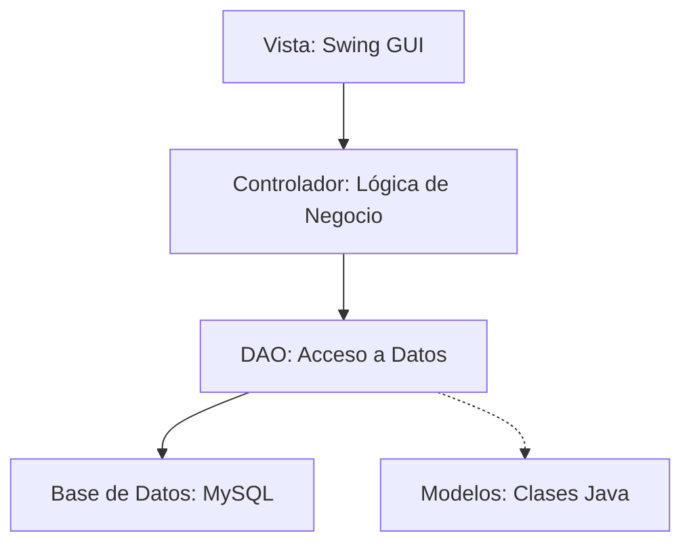

# Documentación y Explicación Detallada del Proyecto Quiniela Mundial 2026

Este documento proporciona una explicación completa de la arquitectura, lógica de negocio, interfaces de usuario y el funcionamiento del código del proyecto **Quiniela Mundial 2026** implementado en Java con entorno gráfico Swing y base de datos MySQL.

---

## 1. Introducción y Reglas de Negocio
El sistema consiste en una **Quiniela / Polla de Apuestas Deportivas** para el Mundial de Fútbol 2026. Permite que usuarios registrados como **Apostadores** pronostiquen marcadores de partidos de fútbol y ganen puntos en base a la precisión de sus predicciones. El **Administrador** gestiona los resultados reales del mundial.

### Sistema de Puntos
Una vez que el Administrador ingresa el marcador real de un partido, el sistema calcula automáticamente los puntos acumulados por cada apostador según las siguientes reglas:
* **3 Puntos (Acierto Perfecto)**: El apostador predice el marcador exacto del partido (ej. pronóstico 2-1 y resultado real 2-1).
* **2 Puntos (Ganador Correcto)**: El apostador acierta al equipo ganador o predice un empate, pero no los goles exactos (ej. pronóstico 2-0, resultado real 1-0; o pronóstico 1-1, resultado real 2-2).
* **1 Punto (Acierto Parcial / Consolación)**: El apostador no adivina el ganador ni el resultado, pero intentó pronosticar un marcador.

### Flujo de Apuestas y Bloqueo
* **Ingreso Único**: Un apostador solo puede guardar su pronóstico para un partido **una sola vez**. Una vez guardado, el campo de goles (`JSpinner`) se deshabilita para evitar modificaciones posteriores, asegurando la transparencia del juego.
* **Control de Fechas**: Las fechas y horas de los partidos no bloquean al usuario para realizar pruebas en esta versión, lo que permite ingresar datos en cualquier momento para verificar la funcionalidad completa del sistema.

---

## 2. Arquitectura de Software: Patrón MVC + DAO
El proyecto está estructurado siguiendo las mejores prácticas de diseño de software utilizando una arquitectura orientada a capas: **Modelo-Vista-Controlador (MVC)** junto con el patrón **DAO (Data Access Object)** para el aislamiento de las operaciones de base de datos.



### Capa de Modelos (`src/modelo/`)
Representa las entidades del dominio de la aplicación mediante objetos POJO (Plain Old Java Objects) con atributos, constructores y métodos getters/setters:
1. **[Usuario.java](file:///c:/JAVA/Mundial/src/modelo/Usuario.java)**: Representa tanto a apostadores como a administradores. Almacena el `id`, `nombre`, `cédula` y el `rol` (Administrador o Usuario).
2. **[Partido.java](file:///c:/JAVA/Mundial/src/modelo/Partido.java)**: Representa los partidos programados, sus equipos, la fecha, y los goles reales (que pueden ser `null` si aún no se ha jugado el partido).
3. **[Apuesta.java](file:///c:/JAVA/Mundial/src/modelo/Apuesta.java)**: Representa el pronóstico realizado por un apostador para un partido específico.

### Capa DAO (`src/dao/`)
Realiza la comunicación directa con MySQL mediante sentencias JDBC (Java Database Connectivity):
1. **[ConexionBD.java](file:///c:/JAVA/Mundial/src/dao/ConexionBD.java)**: Centraliza la conexión JDBC al servidor MySQL local en la base de datos `mundial` usando el driver `com.mysql.cj.jdbc.Driver`.
2. **[UsuarioDAO.java](file:///c:/JAVA/Mundial/src/dao/UsuarioDAO.java)**: Contiene consultas SQL para validar inicios de sesión, registrar apostadores en la base de datos, validar cédulas o nombres duplicados, y calcular el ranking de apostadores ordenados por puntos.
3. **[PartidoDAO.java](file:///c:/JAVA/Mundial/src/dao/PartidoDAO.java)**: Administra la consulta y actualización de los partidos del mundial.
4. **[ApuestaDAO.java](file:///c:/JAVA/Mundial/src/dao/ApuestaDAO.java)**: Gestiona la inserción y consulta de las apuestas. Además, consulta el historial de auditoría de apuestas guardadas.

### Capa Controladores (`src/controlador/`)
Actúan como intermediarios entre la interfaz de usuario (Vista) y el acceso a datos (DAO), procesando las entradas y aplicando lógica antes de llamar a la base de datos:
1. **[UsuarioControlador.java](file:///c:/JAVA/Mundial/src/controlador/UsuarioControlador.java)**: Gestiona la autenticación de usuarios y registros, validando que los datos no estén vacíos.
2. **[ApuestaControlador.java](file:///c:/JAVA/Mundial/src/controlador/ApuestaControlador.java)**: Centraliza los procesos de registrar apuestas individuales, obtener partidos del mundial filtrados por grupo, y registrar los marcadores oficiales ingresados por el administrador.

### Capa Vista (`src/vista/`)
Construye el entorno gráfico interactivo para el usuario. Utiliza la librería estándar de Java `javax.swing` y `java.awt`.

---

## 3. Detalle de las Interfaces Gráficas (Vistas)

### A. Pantalla de Login ([Login.java](file:///c:/JAVA/Mundial/src/vista/Login.java))
* **Diseño Estético Premium**: Cuenta con un fondo gris carbón moderno (`new Color(30, 30, 36)`) y detalles en verde esmeralda y azul brillante.
* **Validación**:
  - Verifica que los campos de cédula y contraseña no estén vacíos.
  - Asegura mediante una expresión regular (`cedula.matches("\\d+")`) que la cédula ingresada contenga únicamente dígitos numéricos.
* **Interacción**: Si las credenciales son válidas, abre la pantalla del `MenuPrincipal` y destruye la ventana de Login mediante `dispose()`.

### B. Pantalla de Registro ([Registro.java](file:///c:/JAVA/Mundial/src/vista/Registro.java))
* **Diálogo Modal**: Es un `JDialog` modal que bloquea la pantalla de fondo hasta que se complete o cancele el registro.
* **Validaciones estrictas**:
  - Cédula únicamente numérica.
  - Nombre con longitud mínima de 3 caracteres y que contenga únicamente letras y espacios.
  - Contraseña con un mínimo de 4 caracteres.
  - Búsqueda en tiempo real en la base de datos para asegurar que no se dupliquen cédulas ni nombres de usuario registrados previamente.

### C. Menú Principal Dashboard ([MenuPrincipal.java](file:///c:/JAVA/Mundial/src/vista/MenuPrincipal.java))
Es la pantalla central de la aplicación y se compone de un **Sidebar** de navegación a la izquierda y un **Panel de Contenido** dinámico a la derecha que cambia según la sección seleccionada mediante el administrador de diseño `CardLayout`.

#### Pestañas / Paneles Disponibles:
1. **Inicio / Home**: 
   - Muestra un saludo personalizado con el nombre del usuario.
   - Muestra tarjetas de estadísticas (Puntos acumulados y puesto actual en el ranking).
   - Proporciona botones de acceso rápido que redirigen al usuario directamente a las diferentes secciones.
2. **Partidos (Pronósticos - Vista del Apostador)**:
   - Permite al apostador filtrar los partidos por grupo (A al L).
   - Presenta los campos para ingresar los goles usando `JSpinner`.
   - **Control de entrada estricto**: Cada spinner cuenta con un filtro de teclado (`KeyListener`) y de copiado/pegado (`DocumentFilter`) que consume cualquier carácter no numérico en tiempo real.
   - Si el apostador ya guardó una predicción para ese partido, los spinners se bloquean automáticamente.
3. **Posiciones (Ranking)**:
   - Muestra una tabla estilizada (`JTable`) con el listado de apostadores ordenados de mayor a menor puntaje, junto con su puesto actual en el torneo. Excluye de forma automática a los usuarios administradores.
4. **Mis Apuestas / Todas las Apuestas**:
   - Si el usuario es un apostador, muestra una tabla detallada con sus pronósticos guardados.
   - Si es administrador, muestra el listado general de todas las apuestas registradas en el sistema.
5. **Gestionar Resultados (Vista del Administrador)**:
   - Permite al administrador ingresar el resultado final oficial de cada partido del grupo seleccionado.
   - **Automatización**: Al modificar el valor del spinner (sea con teclado o con los botones de flecha), la casilla **"Finalizado"** correspondiente al partido se marca automáticamente.
   - Al pulsar "Registrar Resultados", el sistema actualiza la base de datos y recalcula los puntos de todos los apostadores.
6. **Historial de Auditoría (Vista del Administrador)**:
   - Tabla en la que se visualizan en tiempo real todas las acciones que ocurren sobre las apuestas (quién apostó, en qué fecha y qué marcador ingresó).

---

## 4. Base de Datos y Triggers (Auditoría)
La persistencia de datos está implementada sobre MySQL con la base de datos llamada `mundial`.

### Tablas Principales:
* **`grupos`**: Almacena los identificadores de grupo (A-L).
* **`equipos`**: Registra los nombres de los equipos y su grupo asignado.
* **`partidos`**: Contiene la información de los encuentros, fechas y goles reales.
* **`roles`**: Contiene los roles disponibles (`ADMINISTRADOR` y `USUARIO`).
* **`apostadores`**: Registra las cuentas de usuario, sus cédulas, contraseñas encriptadas y rol.
* **`apuestas`**: Registra la relación única entre un apostador, un partido y el marcador pronosticado.
* **`historial_apuestas`**: Tabla de auditoría para registrar cada vez que se guarda una apuesta.

### Triggers y Vistas en la BD:
1. **Trigger `trg_apuestas_insert`**: Activado automáticamente después de que un apostador ingresa un nuevo registro en la tabla `apuestas`. Realiza un registro automático en `historial_apuestas` con la fecha y hora exacta del sistema.
2. **Vista `ranking_apostadores`**: Vista calculada que determina de manera dinámica el puntaje total de cada apostador sumando los puntos obtenidos de todos los partidos registrados basándose en el sistema de puntuación del mundial (3, 2 o 1 punto).

---

## 5. Seguridad y Criptografía (BCrypt)
La aplicación utiliza el estándar de encriptación **BCrypt** de Blowfish para proteger las contraseñas.
* **Clase `BCrypt.java`**: Implementación nativa en Java de Damien Miller, que realiza un cifrado hash de un solo sentido (irreversible).
* **Generación de Sal (Salt) Aleatoria**: BCrypt aplica una sal aleatoria diferente para cada cifrado. Esto significa que si dos usuarios tienen la misma contraseña, sus hashes almacenados en la base de datos serán completamente distintos, evitando ataques de diccionario o tablas arcoíris.
* **Clase de Abstracción `HashUtil.java`**:
  - `hashPassword(password)`: Encripta una contraseña con BCrypt y retorna el hash.
  - `checkPassword(plainPassword, storedHash)`: Realiza una comparación segura por tiempo constante para verificar si la contraseña coincide con el hash encriptado, capturando cualquier excepción para evitar fallas del sistema.

---

## 6. Compilación y Ejecución
Para compilar y ejecutar manualmente la aplicación desde la terminal, se utilizan los siguientes comandos dentro del directorio del proyecto (`c:\JAVA\Mundial`):

* **Compilar todo el código fuente**:
  ```bash
  javac -encoding UTF-8 -d bin -cp "lib/*;bin" -sourcepath src src/Main.java
  ```

* **Ejecutar la aplicación**:
  ```bash
  java -cp "bin;lib/*" Main
  ```
